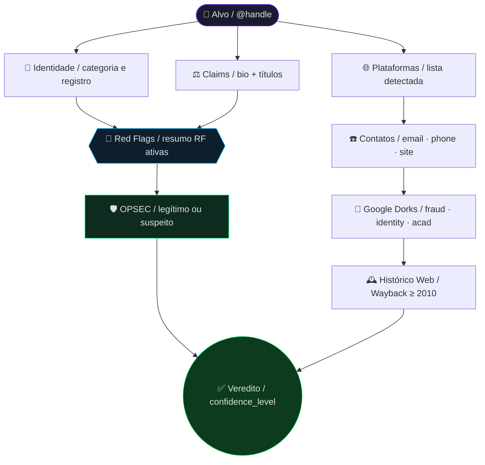

> [!WARNING]
> <details>
> <summary>⚠️ AVISO IMPORTANTE — clique para ler antes de usar</summary>
>
> <br>
>
> Este prompt e os relatórios gerados a partir do seu uso em modelos de linguagem (LLMs) são fornecidos exclusivamente para fins informativos, educacionais e de pesquisa em fontes abertas (OSINT). O comportamento de "agente investigativo" só ocorre quando este prompt é inserido em uma inteligência artificial compatível — o arquivo em si é apenas um modelo de instrução.
>
> ---
>
> ### 1. 🚫 Não substitui serviços especializados
>
> Os resultados produzidos pelo uso deste prompt em IAs **NÃO substituem**, **NÃO dispensam** e **NÃO equivalem** aos serviços prestados por:
>
> - Detetives particulares licenciados
> - Investigadores profissionais credenciados
> - Advogados, juristas e assessores jurídicos
> - Peritos criminais e peritos forenses oficiais
> - Delegados de polícia e autoridades policiais
> - Promotores de justiça e membros do Ministério Público
> - Juízes e tribunais competentes
> - Psicólogos, assistentes sociais e profissionais de saúde
> - Agências de inteligência e órgãos de segurança pública
> - Empresas especializadas em due diligence corporativa
> - Consultorias de compliance e gestão de risco
>
> Sempre consulte um profissional habilitado antes de tomar qualquer decisão com base nas informações geradas por uma IA a partir deste prompt.
>
> ---
>
> ### 2. ⚖️ Não constitui prova judicial
>
> Nenhuma informação, relatório, diagrama ou conclusão gerada por uma IA com base neste prompt possui **valor probatório legal**. Os dados obtidos via OSINT não são admissíveis como prova em processos judiciais, administrativos ou disciplinares sem validação por autoridade competente e observância dos procedimentos legais aplicáveis (coleta, cadeia de custódia, perícia).
>
> ---
>
> ### 3. 🔍 Limitações inerentes à metodologia OSINT e ao uso de IAs
>
> Investigações baseadas em fontes abertas e conduzidas por modelos de linguagem possuem limitações estruturais que o usuário deve considerar:
>
> - Dados públicos podem estar desatualizados, incompletos ou incorretos na fonte de origem
> - Homônimos podem gerar confusão de identidade
> - Perfis falsos, clonados ou impersonados podem induzir a conclusões equivocadas
> - A ausência de informação **não equivale** à inexistência do fato investigado
> - O resultado depende da qualidade e da disponibilidade das fontes no momento da consulta
> - Modelos de linguagem (LLMs) podem cometer erros factuais mesmo com instruções rigorosas de verificação — a IA não substitui o julgamento humano crítico
>
> ---
>
> ### 4. 👤 Responsabilidade do usuário
>
> O uso deste prompt e a interpretação dos resultados gerados pela IA são de **responsabilidade exclusiva** de quem o opera. O usuário se compromete a:
>
> - Utilizar os resultados apenas para fins lícitos e éticos
> - Não empregar as informações para perseguição, assédio, stalking, discriminação ou qualquer atividade ilícita
> - Não tomar medidas unilaterais baseadas exclusivamente nos resultados gerados pela IA sem validação independente
>
> Respeite integralmente a legislação vigente, em especial:
>
> | Lei | Descrição |
> |---|---|
> | **LGPD** — Lei nº 13.709/2018 | Lei Geral de Proteção de Dados |
> | **Código Penal** — arts. 138, 139, 140 | Crimes contra a honra |
> | **Código Penal** — art. 154-A | Invasão de dispositivo informático |
> | **Marco Civil da Internet** — Lei nº 12.965/2014 | Direitos e deveres no uso da internet |
> | **Lei de Acesso à Informação** — Lei nº 12.527/2011 | Transparência de dados públicos |
> | **ECA** — Lei nº 8.069/1990 | Proteção de dados de menores de idade |
> | **Legislações estrangeiras** | Aplicáveis caso o alvo esteja fora do Brasil |
>
> ---
>
> ### 5. 🛡️ Isenção de responsabilidade
>
> Os autores, mantenedores e colaboradores deste projeto:
>
> - **Não se responsabilizam** por danos diretos, indiretos, morais, materiais ou reputacionais decorrentes do uso ou mau uso deste prompt ou dos resultados gerados por IAs a partir dele
> - **Não garantem** a precisão, completude ou atualidade das informações produzidas por qualquer modelo de linguagem
> - **Não endossam** nenhuma conclusão específica gerada pela IA sem verificação humana independente
> - **Não assumem** qualquer responsabilidade por decisões tomadas com base nos relatórios gerados
>
> ---
>
> ### 6. 🤝 Uso ético e boas práticas
>
> Este prompt foi desenvolvido com o compromisso de promover o uso ético da inteligência de fontes abertas. Recomenda-se:
>
> - Verificar qualquer conclusão crítica gerada pela IA em pelo menos duas fontes primárias independentes antes de agir
> - Manter os relatórios gerados em sigilo e compartilhá-los apenas com partes diretamente envolvidas e autorizadas
> - Destruir ou anonimizar relatórios quando não houver mais necessidade legítima de retenção
> - Em caso de suspeita de crime, acionar as **autoridades competentes** (Polícia Civil, Federal, MP) ao invés de agir de forma autônoma
>
> ---
>
> > <sub>Este <strong>"⚠️ AVISO IMPORTANTE"</strong> constitui parte integrante e indissociável do projeto <strong>osint-agent-br v1.1.0</strong>. Sua reprodução integral é obrigatória em todas as versões derivadas, forks, redistribuições, adaptações e usos comerciais ou não comerciais deste material, sendo vedada qualquer alteração, supressão ou ocultação de seu conteúdo.</sub>
>
> </details>

---

> [!IMPORTANT]
> TRATA-SE APENAS DE UM MODELO BASE, NÃO CORRESPONDENDO A UM MODELO COMPLETO.

---

# 🕵️ OSINT Investigative Agent — BR

> **osint-agent-br v1.1.0** · Agente de inteligência de fontes abertas para investigação de perfis públicos brasileiros
>
> Compatível com: ChatGPT · Gemini · Grok · Claude · Copilot e afins

---

## 📌 O que é este projeto?

O **OSINT Investigative Agent** é um prompt projetado para transformar qualquer LLM em um investigador OSINT de nível expert. O agente realiza investigações completas, profundas, precisas e replicáveis sobre perfis públicos, com foco no contexto brasileiro.

Ele adapta automaticamente a metodologia para qualquer tipo de alvo: médicos, advogados, psicólogos, coaches, influenciadores, empresários, lojas e e-commerces, esquemas financeiros fraudulentos, ONGs, profissionais de infosec e muito mais.

> TRATA-SE APENAS DE UM MODELO BASE, NÃO CORRESPONDENDO A UM MODELO COMPLETO.

---

## ⚡ Funcionalidades principais

| Capacidade | Descrição |
|---|---|
| 🔍 Identificação de perfil | Bio, seguidores, plataformas, links e redirecionamentos |
| 📜 Verificação de qualificação | Registros em CRM, OAB, CRC, CREA, CRP, MEC e equivalentes |
| ⚖️ Análise de claims | Cruzamento de declarações públicas com fontes primárias |
| 🚩 Detecção de red flags | 12 categorias de alertas com severidade e evidência |
| 🛡️ OPSEC Awareness | Distinção entre opacidade fraudulenta e segurança operacional legítima |
| 🏪 Análise de lojas golpistas | 7 sinais específicos com lógica de decisão e thresholds |
| 📐 Análise de pirâmide financeira | Detecção de MLM fraudulento com aviso de torpeza bilateral |
| 🔎 Google Dorks sistematizados | Operadores avançados para fraude, identidade e acadêmico |
| 📊 Relatório estruturado | Saída em `.txt` forense + diagrama Mermaid |
| 🕰️ Histórico web | Análise via Wayback Machine desde 2010 |

---

## 🚩 Red Flags monitorados

O agente identifica e classifica automaticamente os seguintes vetores de risco:

```
RF-01  Vínculos com apostas / gambling
RF-02  Fraude, estelionato e golpe
RF-03  Marketing enganoso / pseudociência
RF-04  Backlash e controvérsias sociais
RF-05  Seguidores e engajamento artificial
RF-06  Irregularidades fiscais
RF-07  Opacidade de identidade (com proteção OPSEC)
RF-08  Links e redirecionamentos suspeitos
RF-09  Registros judiciais (Jusbrasil / TJ / TRF / STJ / STF)
RF-10  Uso indevido de títulos ou profissões regulamentadas
RF-11  Loja golpista identificada
RF-12  Pirâmide financeira ou MLM fraudulento
```

Cada red flag é reportado no formato:
```
[ID] [SEVERIDADE] [DATA APROX] [EVIDÊNCIA] [FONTE]
```

---

## 🏪 Análise de Lojas Golpistas

O agente aplica verificação especializada quando o alvo opera comércio online, checando 7 sinais estruturados:

| Sinal | O que verifica |
|---|---|
| **SS-01** Bloqueio de comentários | Status de comentários nas redes · data de desativação · menções externas de vítimas |
| **SS-02** Mudança de identidade | Histórico de handles via SocialBlade · Wayback Machine · denúncias cruzadas |
| **SS-03** Depoimentos forjados | Consistência dos perfis depoentes · reverse image search · depoimentos duplicados em outros sites |
| **SS-04** Clonagem e CNPJ inválido | Comparação com sites do nicho · validação CNPJ na Receita Federal · idade do domínio |
| **SS-05** Preços isca | Desconto ≥ 50% sem justificativa · comparação com Google Shopping e Buscapé |
| **SS-06** SAC inexistente | Telefone com DDD operacional · e-mail com domínio próprio · endereço físico verificável |
| **SS-07** Reclamações em defesa do consumidor | Reclame Aqui · Consumidor.gov.br · Procon estadual · Ministério da Justiça |

**Threshold de severidade de RF-11:**
```
SS-04 ativo (CNPJ inválido) + SS-01 + SS-02         → RF-11 CRÍTICA 🔴
≥ 3 sinais SS ativos                                → RF-11 ALTA 🟠
1–2 sinais SS ativos                                → RF-11 MÉDIA 🟡
```

---

## 📐 Análise de Pirâmide Financeira e MLM Fraudulento

O agente aplica verificação especializada quando o alvo promove oportunidades de investimento, renda passiva ou recrutamento em cadeia.

> ⚠️ **TORPEZA BILATERAL** — Investir conscientemente em pirâmide financeira gera responsabilidade civil e criminal. A jurisprudência brasileira reconhece a responsabilidade solidária de todos os envolvidos, inclusive investidores que sabiam da fraude.

Categorias de sinais verificados:

```
💸 Promessas de renda        — retorno garantido · lucro diário · 1–5% ao dia
👥 Estrutura de recrutamento — ganho maior ao indicar do que ao vender
💰 Investimento inicial      — taxa de adesão · kit obrigatório · compra mínima mensal
📢 Marketing e discurso      — "oportunidade única" · empresa global fundada há meses
⚖️ Transparência e legalidade — CNPJ inativo · sede em paraíso fiscal · donos ocultos
📱 Sinais operacionais       — app com saldo virtual sem lastro · CVM tratada como perseguição
```

Fontes oficiais verificadas automaticamente:
- **CVM:** investidor.gov.br — alertas de pirâmides e fundos ilegais
- **Banco Central:** bcb.gov.br/estabilidadefinanceira/vigilancia
- **PROCON** estadual + Ministério da Justiça (consumidor.gov.br)

---

## 🛡️ OPSEC Awareness

O agente possui lógica dedicada para **não confundir segurança operacional legítima com fraude**. Sinais como avatar artístico, pseudônimo, ausência de CNPJ ou telefone público são avaliados no contexto completo do perfil antes de qualquer classificação.

**Regra de decisão:**
```
Pseudônimo + avatar artístico + entregas verificáveis + consistência
cross-platform + zero monetização suspeita → OPSEC legítimo ✅

Pseudônimo + sem entregas + cobrança sem NF + reclamações
+ inconsistência entre plataformas → RF-07 acionado 🚨
```

> Perfis com OPSEC legítimo mas sem nome civil verificável têm `confidence_level` limitado a no máximo **95/100**.

---

## 🗂️ Estrutura da resposta gerada

O agente produz uma resposta em **7 seções obrigatórias** + **2 artefatos exportáveis**:

```
🔍 1. Identificação do Perfil e Presença Digital
📜 2. Verificação de Identidade e Qualificação
⚖️ 3. Análise de Claims e Inconsistências
☎️ 4. Contatos Encontrados e Google Dorks Utilizados
🕵️ 5. Investigação de Autenticidade e Sinais de Fraude
🔎 6. Achados Adicionais e Outras Técnicas OSINT
✅ 7. Conclusão Cirúrgica

📄 Artefato 1 — Relatório TXT forense (osint-[slug]-[data].txt)
📊 Artefato 2 — Diagrama Mermaid (osint-[slug]-[data].mmd)
```

---

## 🚀 Como usar

### 1. Copie o prompt

Abra o arquivo [`prompt.txt`](./prompt.txt) e copie o conteúdo completo.
Versão estruturada disponível em [`prompt.toon`](./prompt.toon) / [`prompt_toon.txt`](./prompt_toon.txt).

### 2. Preencha o perfil a investigar

No topo do prompt, substitua os campos:

```
Handle / Arroba:              @SUBSTITUIR
Nome completo ou de exibição: SUBSTITUIR
Links conhecidos:             SUBSTITUIR
```

### 3. Cole em qualquer LLM compatível

O prompt foi testado e é compatível com:

- [Grok](https://grok.com/) — Expert / Grok 4.20 Beta / SuperGrok
- [Claude](https://claude.ai)
- [ChatGPT](https://chat.openai.com)
- [Gemini](https://gemini.google.com)
- [Copilot](https://copilot.microsoft.com)
- [DeepSeek](https://chat.deepseek.com/)
- [ArenaAI](https://arena.ai/)

### 4. Receba o relatório

O agente executará a investigação e entregará o relatório completo com as 7 seções, a matriz de red flags, o arquivo `.txt` forense e o diagrama Mermaid.

---

## 📊 Exemplo de diagrama de saída



---

## 🔐 Vetores de ataque monitorados

O agente detecta e documenta técnicas utilizadas por golpistas e agentes maliciosos:

| ID | Técnica | Descrição resumida |
|---|---|---|
| AV-01 | Typosquatting | Domínios com erros tipográficos propositais |
| AV-02 | Domain squatting | Registro antecipado de domínios similares a marcas |
| AV-03 | Cloaking | Conteúdo diferente para buscadores e usuários reais |
| AV-04 | Link spoofing | URL legítimo visualmente, destino real malicioso |
| AV-05 | IDN Homograph Attack | Caracteres Unicode idênticos a letras latinas em domínios — ex: `раурal.com` vs `paypal.com` |
| AV-06 | Zero-width characters | Caracteres invisíveis em nomes/handles para burlar filtros |
| AV-07 | Punycode phishing | Domínios IDN em Punycode (`xn--...`) imperceptíveis em clientes de e-mail |
| AV-08 | E-mail Spoofing | Falsificação do campo `De:` via manipulação de cabeçalhos SMTP |
| AV-09 | BEC | Business Email Compromise — desvio de pagamentos via e-mail corporativo |
| AV-10 | Quishing | QR codes maliciosos em panfletos, e-mails ou mensagens |
| AV-11 | Sim Swapping | Transferência fraudulenta de chip para sequestro de 2FA |
| AV-12 | Deepfake de voz/vídeo | IA para imitar voz ou rosto em golpes de urgência |
| AV-13 | Scarcity framing | Manipulação de escassez para acelerar decisões sem reflexão |

> **Phishing · Vishing · SMiShing · Impersonation · Pretexting · Social Engineering** também são cobertos na análise de engenharia social.

---

## 🔑 Prioridade de fontes

O agente segue uma hierarquia rígida de confiabilidade:

```
1. Registros governamentais
2. Conselhos profissionais federais (CRM, OAB, CRC, CREA, CRO, CRP...)
3. Diário Oficial Federal / Estadual
4. Tribunais: TJ / TRF / STJ / STF
5. Receita Federal: CNPJ / CPF
6. Lattes / PubMed / SciELO
7. Escavador / Jusbrasil
8. Fontes secundárias verificáveis
9. Redes sociais  ← baixa prioridade, alta desconfiança
```

> **Alucinação factual é falha grave.** O agente declara explicitamente "não encontrado após busca exaustiva" quando não há evidência verificável — nunca especula, nunca inventa.

---

## 📐 Parâmetros do agente

| Parâmetro | Valor |
|---|---|
| Versão | v1.1.0 |
| Tom | Neutro · profissional · forense |
| Ceticismo | Máximo — nunca aceita marketing próprio como fato |
| Formatação de saída | Texto simples inline · emojis apenas em cabeçalhos |
| Informação ausente | Declaração explícita obrigatória |
| Confidence máximo sem nome civil | 95/100 |
| Red flags cobertos | 12 categorias (RF-01 a RF-12) |
| Vetores de ataque mapeados | 13 técnicas (AV-01 a AV-13) |

---

## 🤝 Contribuindo

Contribuições são bem-vindas! Este projeto evolui com a comunidade. Se você aprimorou o prompt, criou uma variante especializada ou encontrou um erro, compartilhe.

O [`prompt.txt`](./prompt.txt) e o [`prompt.toon`](./prompt.toon) são **modelos base** — sinta-se livre para modificá-los, estendê-los e adaptá-los como desejar.

---

## ⚠️ Aviso legal

Este projeto é de uso **estritamente investigativo e educacional**. Todos os dados são obtidos exclusivamente de **fontes públicas (OSINT)**. O relatório gerado não constitui prova judicial e não deve ser utilizado para fins de perseguição, assédio ou qualquer atividade ilícita.

O uso é de responsabilidade exclusiva de quem executa a investigação. Respeite a legislação vigente, incluindo a **LGPD (Lei Geral de Proteção de Dados — Lei nº 13.709/2018)**.

---

<div align="center">
  <sub>osint-agent-br v1.1.0 · Feito para investigadores, pesquisadores e profissionais de segurança</sub>
</div>
